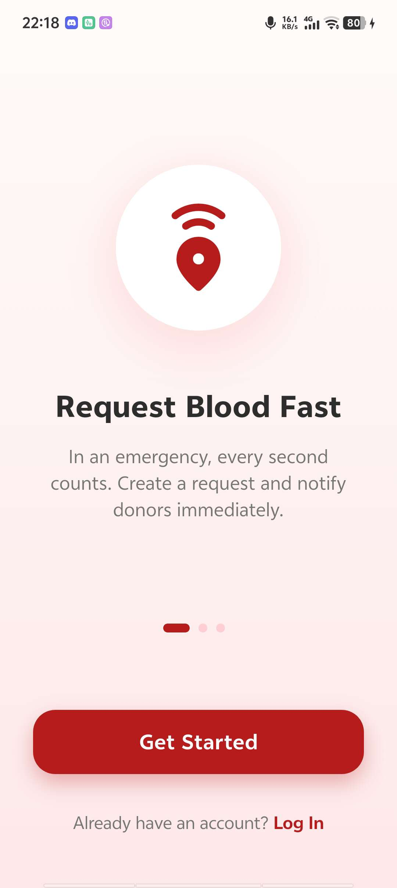
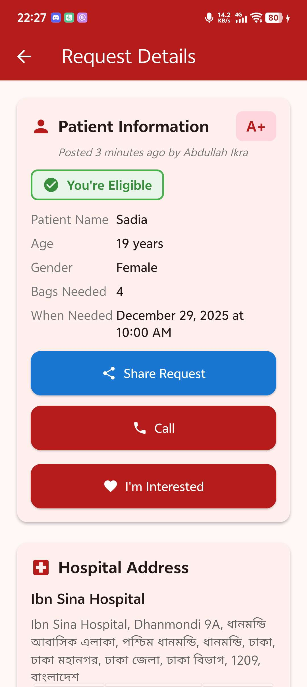
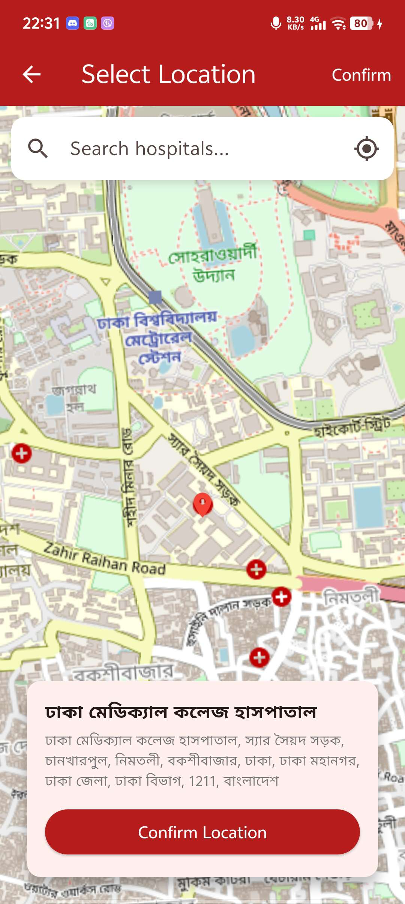

# 🩸 BloodLinker

  

**BloodLinker** is a sophisticated, life-saving mobile application designed to bridge the gap between blood donors and patients in real-time. By removing middlemen and utilizing live data streams, it ensures critical requests are seen, shared, and acted upon instantly.

---

## 📖 Table of Contents

- [Project Description](#project-description)
- [Key Features](#key-features)
- [App Workflow](#app-workflow)
- [Screenshots](#screenshots)
- [Technical Architecture](#technical-architecture)
- [Tech Stack](#tech-stack)
- [Installation & Setup](#installation--setup)

---

## Project Description

Blood donation delays can be fatal. **BloodLinker** solves this by creating a direct, real-time pipeline between those in need and those who can help.

Unlike traditional directories, BloodLinker features a **Live Dashboard** that updates instantly using Cloud Firestore streams. It empowers users to post detailed urgent requests and manage the entire donation lifecycle—from expressing interest to reserving a donor and marking the request as completed.

## ✨ Key Features

### 🚀 Core Functionality

- **Live Dashboard:** A real-time feed of blood requests that updates instantly on all devices without refreshing.
- **Smart Filtering:** Users can filter the feed by specific blood types (e.g., A+, O-) to find relevant requests immediately.
- **Viral Sharing:** Integrated sharing capabilities allow users to copy urgency details (Hospital, Blood Group, Phone) to WhatsApp or social media with one tap.

### 🤝 Advanced Donor Workflow

- **Interest System:** Eligible donors can mark themselves as "Interested" in a request.
- **Reservation Logic:** Requesters can view interested donors and "Reserve" one, locking the request to prevent double-booking.
- **Completion Tracking:** Once the donation is successful, the request is marked as "Completed," automatically updating the donor's history and last donation date.

### 🎨 Elegant UI/UX

- **Onboarding Carousel:** A beautiful, animated slider introduces new users to the app's core value propositions.
- **Modern Design:** Features a curved gradient header, soft-shadow floating cards, and clear visual hierarchy for maximum readability.
- **Smart Badges:** Visual indicators for "Emergency", "Eligible Donor", and "Reserved" status help users scan information fast.

### 🛠️ Utilities

- **One-Tap Call:** Bypasses the app sandbox to trigger the native phone dialer for immediate communication.
- **Smart Maps Integration:** Automatically detects installed navigation apps (Google Maps, Apple Maps) to provide directions to the hospital.

## 📱 App Workflow

1.  **Request:** A user posts a blood request (e.g., "A+ needed at Square Hospital").
2.  **Notify:** The request appears instantly on the Live Feed.
3.  **Interest:** A donor sees the request, checks eligibility (automated by the app), and clicks "I'm Interested."
4.  **Reserve:** The requester sees the list of interested donors and clicks "Reserve" on one.
5.  **Complete:** After donation, the requester clicks "Mark as Completed." The request is removed, and the donor's profile is updated.

## 📸 Screenshots

|                   **Onboarding**                   |                **Home Feed**                 |                **Donor Details**                |               **Request Map**               |
| :------------------------------------------------: | :------------------------------------------: | :---------------------------------------------: | :-----------------------------------------: |
|  |  |  |  |

## 🏗️ Technical Architecture

The app operates on a custom **Reactive Pipeline** architecture:

1.  **Write Pipeline:**
    - User submits a form with extended metadata (Location, Urgency, Patient Info).
    - Data is validated and pushed to the `requests` collection in Cloud Firestore with a server timestamp.
2.  **Read Pipeline:**
    - The Dashboard uses a `StreamBuilder` combined with complex Firestore queries to allow real-time filtering by `bloodGroup`.
    - This ensures 0-latency updates when new requests match the user's filter.
3.  **Transaction Pipeline:**
    - Complex state changes (Reserving a donor, Unreserving, Completing) use Firestore Transactions or Batched Writes to ensure data integrity across multiple users.

## 💻 Tech Stack

- **Framework:** [Flutter](https://flutter.dev/) (Dart)
- **Backend:** [Firebase Authentication](https://firebase.google.com/products/auth) & [Cloud Firestore](https://firebase.google.com/products/firestore)
- **State Management:** `provider`
- **Utilities:** `url_launcher` (intents), `intl` (formatting), `share_plus` (sharing)

## ⚙️ Installation & Setup

This project is configured for immediate demonstration purposes.

### 1. Prerequisites

- Flutter SDK installed
- An Android Emulator or Physical Device

### 2. Clone the Repository

```bash
git clone [https://github.com/your-username/BloodLinker.git](https://github.com/your-username/BloodLinker.git)
cd BloodLinker
```
