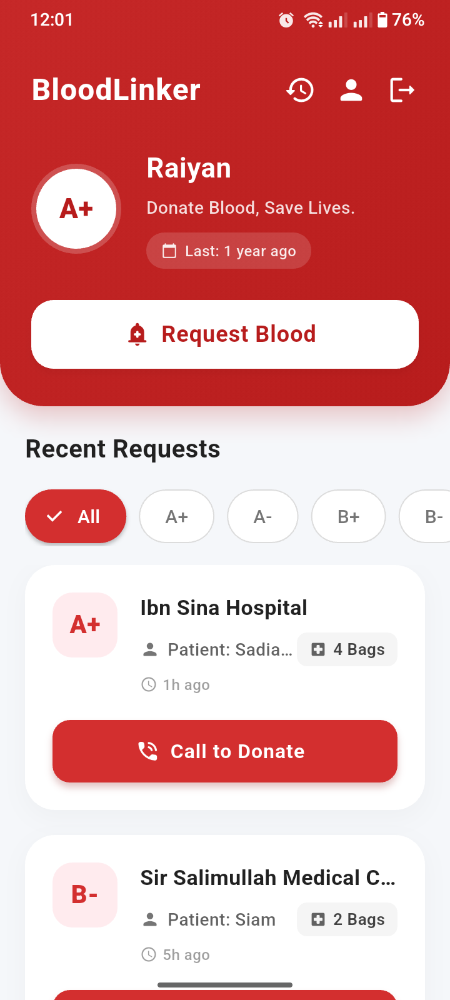

# 🩸 BloodLinker

   

**BloodLinker** is a life-saving mobile application designed to bridge the gap between blood donors and patients in real-time. By removing middlemen and utilizing live data streams, it ensures critical requests are seen and acted upon instantly.

---

## 🎨 Design Philosophy: "Vital Red & Medical White"

We moved away from standard Material Design to create a custom aesthetic focused on trust and urgency.

- **Primary Color:** `#E63946` (Vital Red) - Chosen for urgency without being alarming.
- **Background:** `#F8F9FA` (Clean Grey) - Reduces eye strain compared to pure white.
- **Typography:** Google Fonts (`Poppins` / `Lato`) for modern readability.
- **Components:** Custom curved headers and soft-shadow cards for a premium feel.

## 🏗️ Technical Architecture

The app operates on a **Write/Read Pipeline** architecture powered by Firebase:

1.  **Write Pipeline:**
    - User submits a `BloodRequest` form (Patient Name, Bags, Location).
    - Data is validated and pushed to the `requests` collection in Cloud Firestore.
2.  **Read Pipeline:**
    - The Dashboard uses a `StreamBuilder` to maintain a live, persistent connection to the database.
    - New requests appear instantly on all devices without pull-to-refresh.
3.  **Action Pipeline:**
    - The "Call to Donate" feature bypasses the app sandbox using `LaunchMode.externalApplication` to trigger the native Android/iOS dialer.

## ✨ Key Features

- [x] **Secure Authentication:** Firebase Email/Password login with session persistence.
- [x] **Live Dashboard:** Real-time feed of blood requests sorted by urgency (timestamp).
- [x] **One-Tap Contact:** Direct dialer integration to connect donors to patients immediately.
- [x] **Smart Formatting:** Auto-converts database enums (e.g., `bPositive`) to human-readable text (`B+`).
- [x] **Secure Navigation:** Logic to clear navigation stacks upon logout to prevent unauthorized access.

## 📱 Screenshots

|                **Dashboard**                 |                **Request Form**                 |               **Direct Call**                |
| :------------------------------------------: | :---------------------------------------------: | :------------------------------------------: |
|  |  |  |

## ⚙️ Installation & Setup

This project comes pre-configured with a demo Firebase environment for easy testing.

### 1. Prerequisites

- Flutter SDK installed
- An Android Emulator or Physical Device

### 2. Clone the Repository

```bash
git clone [https://github.com/your-username/BloodLinker.git](https://github.com/your-username/BloodLinker.git)
cd BloodLinker
```
