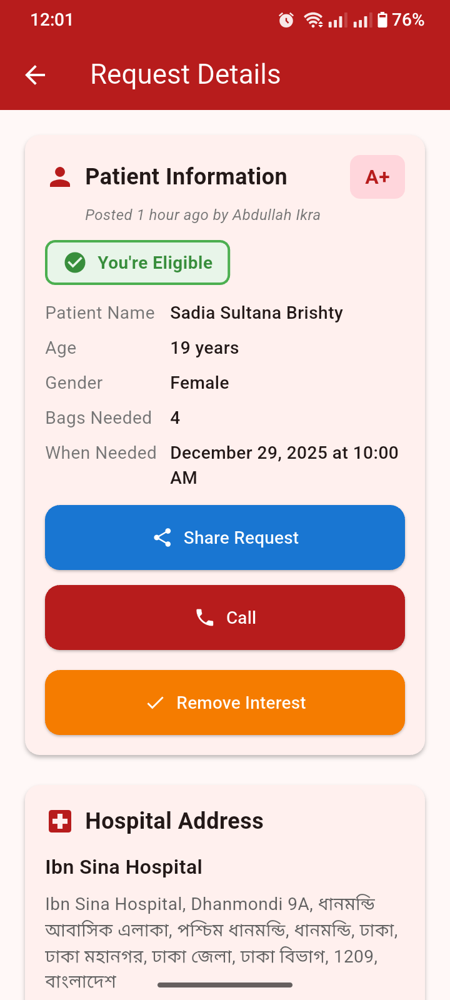

# 🩸 BloodLinker

  

**BloodLinker** is a life-saving mobile application designed to bridge the gap between blood donors and patients in real-time. By removing middlemen and utilizing live data streams, it ensures critical requests are seen and acted upon instantly.

---

## Table of Contents

- [Project Description](#project-description)
- [Key Features](#key-features)
- [Screenshots](#screenshots)
- [Technical Architecture](#technical-architecture)
- [Tech Stack](#tech-stack)
- [Installation & Setup](#installation--setup)
- [Future Roadmap](#future-roadmap)
- [Contributing](#contributing)
- [Contact](#contact)

---

## Project Description

Blood donation delays can be fatal. **BloodLinker** solves this by creating a direct, real-time pipeline between those in need and those who can help.

Unlike traditional directories, BloodLinker features a **Live Dashboard** that updates instantly using Cloud Firestore streams. It empowers users to post detailed urgent requests (including emergency flags and location data) and provides a "One-Tap Call" feature that bypasses the app sandbox to trigger the native phone dialer, ensuring immediate communication.

## Key Features

### 🚀 Core Functionality

- **Live Dashboard:** A real-time feed of blood requests that updates instantly on all devices without needing to refresh.
- **Smart Filtering:** Users can filter the live feed by specific blood types (e.g., A+, O-) to find relevant requests immediately.
- **Emergency Alerts:** High-priority requests are visually distinct with "Emergency" badges to grab donor attention.

### 🛠️ User Tools

- **Full Request Management:** Users have complete control over their data with Create, Read, Update, and Delete (CRUD) capabilities.
- **Detailed Insights:** Clicking a request opens a detailed view showing patient age, gender, specific notes, and hospital address.
- **Smart Maps Integration:** Automatically detects installed navigation apps (Google Maps, Apple Maps) to provide one-tap directions to the hospital.

### 🔒 Security & Performance

- **Secure Authentication:** Robust email/password login system with session persistence using Firebase Auth.
- **Secure Navigation:** Advanced navigation logic that clears history stacks upon logout to prevent unauthorized access.

## Screenshots

|            **Filtered Dashboard**            |               **Request Details**               |              **Edit/Create Form**               |
| :------------------------------------------: | :---------------------------------------------: | :---------------------------------------------: |
|  |  |  |

_(Note: These screenshots demonstrate the filtering capability, the detailed emergency view, and the comprehensive request form.)_

## Technical Architecture

The app operates on a custom **Write/Read Pipeline** architecture:

1.  **Write Pipeline:**
    - User submits a form with extended metadata (Location, Urgency, Patient Info).
    - Data is validated and pushed to the `requests` collection in Cloud Firestore with a server timestamp.
2.  **Read Pipeline:**
    - The Dashboard uses a `StreamBuilder` combined with complex Firestore queries to allow real-time filtering by `bloodGroup`.
    - This ensures 0-latency updates when new requests match the user's filter.
3.  **Action Pipeline:**
    - The app leverages `url_launcher` with `LaunchMode.externalApplication` to interface directly with the device's native Phone and Map applications.

## Tech Stack

- **Framework:** [Flutter](https://flutter.dev/) (Dart)
- **Backend:** [Firebase Authentication](https://firebase.google.com/products/auth) & [Cloud Firestore](https://firebase.google.com/products/firestore)
- **State Management:** `provider`
- **Utilities:** `url_launcher` (intents), `intl` (formatting)

## Installation & Setup

This project is configured for immediate demonstration purposes.

### 1. Prerequisites

- Flutter SDK installed
- An Android Emulator or Physical Device

### 2. Clone the Repository

```bash
git clone [https://github.com/your-username/BloodLinker.git](https://github.com/your-username/BloodLinker.git)
cd BloodLinker
```
